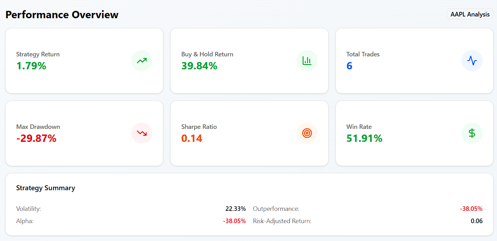

# FinDash 📉 | 

Stock Strategy Analysis & Backtesting Dashboard

> A lightweight, interactive trading strategy dashboard powered by Python 🐍, Streamlit 🚀, and TA-Lib 📊. Visualize moving averages, RSI, MACD, Bollinger Bands, and more — all in one sleek UI.


---

## 🚀 Overview

**FinDash** is a fintech-focused web dashboard designed to test and visualize stock trading strategies based on technical indicators.

It enables users to:

- Analyze stock data using custom date ranges & MA periods  
- View crossover signals (Buy/Sell) with clear chart markers  
- Explore performance metrics like Sharpe Ratio & Max Drawdown  
- Visualize RSI, MACD, and Bollinger Bands interactively  
- Download trade logs directly from the dashboard

---
## 🧪 QuantConnect Backtesting Strategy

To validate the logic of the Streamlit simulation, a parallel backtest was built using **QuantConnect's Lean engine**.

### 💡 Strategy Logic
- **Buy** when short-term MA crosses above long-term MA  
- **Sell** when short-term MA crosses below long-term MA  
- Evaluated on historical data using QuantConnect’s simulation engine

### 📸 QuantConnect Backtest Screenshots

| Rolling Stats | Drawdown & Capacity | Strategy Equity |
|---------------|---------------------|------------------|
|  |  |  |


## 🔧 Features Overview

### 📌 App Interface and Inputs


- Select a stock (via Yahoo Finance)
- Choose the date range
- Adjust short/long SMA periods interactively

### 📈 Stock Price with SMA Crossover


- Closing price plot
- Buy/sell signals
- SMA overlays

### 📊 Strategy Metrics Summary


- Strategy vs. Buy & Hold return
- Trade count
- Sharpe Ratio & Max Drawdown

### 📉 Strategy Summary with RSI


- RSI (14) with overbought/oversold zones
- Helps fine-tune entry/exit points

### 📑 Trade Log Table


- Chronological buy/sell trades
- Downloadable CSV for further analysis

### 🔁 Cumulative Returns Comparison


- Strategy performance vs. holding the stock
- Helps visualize long-term efficiency

---
## 🧪 QuantConnect Backtesting Strategy

To validate the logic of the Streamlit simulation, a parallel backtest was built using **QuantConnect's Lean engine**.

### 💡 Strategy Logic
- **Buy** when short-term MA crosses above long-term MA  
- **Sell** when short-term MA crosses below long-term MA  
- Evaluated on historical data using QuantConnect’s simulation engine

### 📸 QuantConnect Backtest Screenshots

| Rolling Stats | Drawdown & Capacity | Strategy Equity |
|---------------|---------------------|------------------|
|  |  |  |


# FinDash - Connected Frontend & Backend Setup Guide

## 🎯 Overview

Your FinDash project now has a **connected frontend and backend**! The Next.js frontend fetches real financial data from a FastAPI backend that processes stock data using your original Streamlit logic.

## 🏗️ Architecture

```
┌─────────────────┐    HTTP Requests    ┌─────────────────┐
│                 │ ─────────────────► │                 │
│  Next.js        │                    │  FastAPI        │
│  Frontend       │ ◄───────────────── │  Backend        │
│  (Port 3000)    │    JSON Responses  │  (Port 8000)    │
└─────────────────┘                    └─────────────────┘
                                               │
                                               │ yfinance
                                               ▼
                                    ┌─────────────────┐
                                    │  Yahoo Finance  │
                                    │  Real Stock     │
                                    │  Data           │
                                    └─────────────────┘
```

## 🚀 Quick Start

### 1. Start the Backend API

```bash
# Install Python dependencies
pip install -r requirements.txt

# Start the API server
python start_api.py
```

The API will be available at:
- **API**: http://localhost:8000
- **Documentation**: http://localhost:8000/docs
- **Interactive API**: http://localhost:8000/redoc

### 2. Start the Frontend

```bash
# Navigate to frontend directory
cd findash-frontend

# Install dependencies (if not already done)
npm install

# Start the development server
npm run dev
```

The frontend will be available at: http://localhost:3000

## 📡 API Endpoints

### Core Data Endpoints

| Endpoint | Method | Description |
|----------|--------|-------------|
| `/api/stock/price-data` | POST | Get stock prices with moving averages |
| `/api/stock/performance` | POST | Get strategy performance metrics |
| `/api/stock/trades` | POST | Get buy/sell trade log |
| `/api/stock/rsi` | POST | Get RSI indicator data |
| `/api/stock/macd` | POST | Get MACD indicator data |
| `/api/stock/bollinger` | POST | Get Bollinger Bands data |

### Request Format

All endpoints expect a POST request with:

```json
{
  "ticker": "AAPL",
  "start_date": "2022-01-01",
  "end_date": "2023-01-01",
  "sma_short": 20,
  "sma_long": 50
}
```

## 🌟 Features

### Real-Time Data Processing
- ✅ **Live Stock Data**: Fetches real data from Yahoo Finance
- ✅ **Technical Indicators**: RSI, MACD, Bollinger Bands
- ✅ **Trading Signals**: Moving average crossover strategy
- ✅ **Performance Metrics**: Sharpe ratio, max drawdown, win rate

### Interactive Frontend
- ✅ **Responsive Design**: Works on desktop and mobile
- ✅ **Loading States**: Shows spinners while fetching data
- ✅ **Error Handling**: Displays helpful error messages
- ✅ **Real-time Updates**: Click "Update Analysis" to refresh data
- ✅ **Export Functions**: Download trade logs as CSV

### Chart Components
- 📈 **Price Chart**: Stock price with moving averages
- 📊 **RSI Chart**: Relative Strength Index with overbought/oversold levels
- 📉 **MACD Chart**: Moving Average Convergence Divergence with histogram
- 📋 **Bollinger Bands**: Price channels for volatility analysis

## 🛠️ Technical Details

### Backend Technologies
- **FastAPI**: Modern Python web framework
- **yfinance**: Yahoo Finance data fetching
- **pandas**: Data manipulation
- **ta**: Technical analysis indicators
- **uvicorn**: ASGI server

### Frontend Technologies
- **Next.js 15**: React framework with App Router
- **TypeScript**: Type-safe JavaScript
- **Tailwind CSS**: Utility-first CSS framework
- **Recharts**: Chart library for React
- **Radix UI**: Accessible component library

### Data Flow
1. User inputs stock symbol and parameters in frontend
2. Frontend sends HTTP POST request to backend API
3. Backend fetches real stock data from Yahoo Finance
4. Backend calculates technical indicators and trading signals
5. Backend returns processed data as JSON
6. Frontend renders charts and metrics

## 🔧 Configuration

### API Configuration
Edit `api_backend.py` to modify:
- **CORS settings**: Currently allows `http://localhost:3000`
- **Calculation parameters**: Moving average periods, RSI window, etc.
- **Trading logic**: Buy/sell signal generation

### Frontend Configuration  
Edit `src/lib/api.ts` to modify:
- **API base URL**: Currently `http://localhost:8000`
- **Request timeout**: Add timeout handling
- **Retry logic**: Add automatic retries

## 🚨 Troubleshooting

### Common Issues

**1. CORS Errors**
```
Access to fetch at 'http://localhost:8000' blocked by CORS policy
```
**Solution**: Make sure the API server is running and CORS is configured for `http://localhost:3000`

**2. Connection Refused**
```
Failed to fetch: net::ERR_CONNECTION_REFUSED
```
**Solution**: Ensure the API server is running on port 8000

**3. No Data Available**
```
No data found for the given ticker and date range
```
**Solution**: 
- Check if the stock symbol is valid
- Ensure date range includes trading days
- Try popular symbols like AAPL, MSFT, GOOGL

**4. Module Import Errors**
```
ModuleNotFoundError: No module named 'fastapi'
```
**Solution**: Install requirements: `pip install -r requirements.txt`

### Debugging

**Backend Logs**: Check the terminal where you ran `python start_api.py`

**Frontend Logs**: Open browser developer tools (F12) and check the Console tab

**API Testing**: Visit http://localhost:8000/docs to test endpoints directly

## 📊 Example Usage

1. **Start both servers** (backend on 8000, frontend on 3000)
2. **Open frontend** at http://localhost:3000
3. **Enter stock symbol** (e.g., "AAPL")
4. **Set date range** (e.g., 2022-01-01 to 2023-01-01)
5. **Adjust MA periods** using sliders
6. **Click "Update Analysis"** to fetch real data
7. **Explore charts** using the tab navigation
8. **View trade log** and export as CSV

## 🎉 Success!

Your FinDash application now has:
- ✅ Real financial data processing
- ✅ Beautiful, responsive UI
- ✅ Connected frontend and backend
- ✅ Professional-grade error handling
- ✅ Interactive charts and metrics

Happy trading! 📈 

💡 What I Learned
This project helped me dive deep into:

Financial data manipulation using Pandas

Strategy logic using moving averages

Visual analysis via Matplotlib & Streamlit

Indicator overlays using the ta technical analysis library

Building real-world fintech dashboards from scratch

🤝 Connect
Made with ❤️ by Udit Pandey  
[Connect on LinkedIn](https://www.linkedin.com/in/uditpandeyy) ・ [Raise an Issue](https://github.com/uditpandeyy/Fintech-proj/issues)

